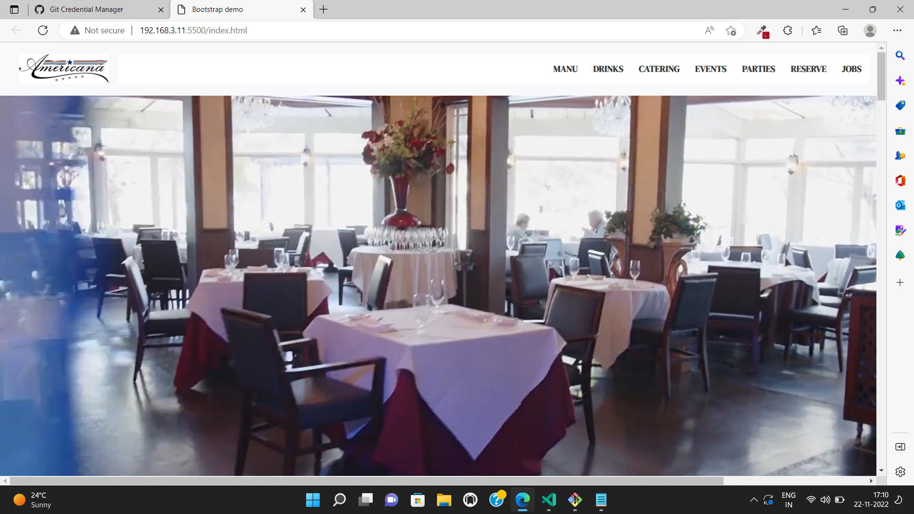
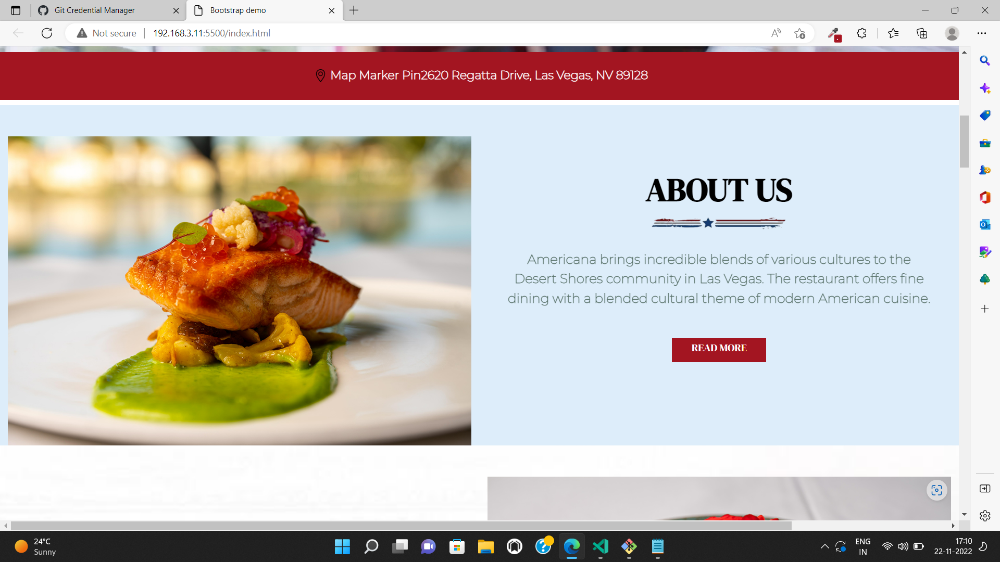
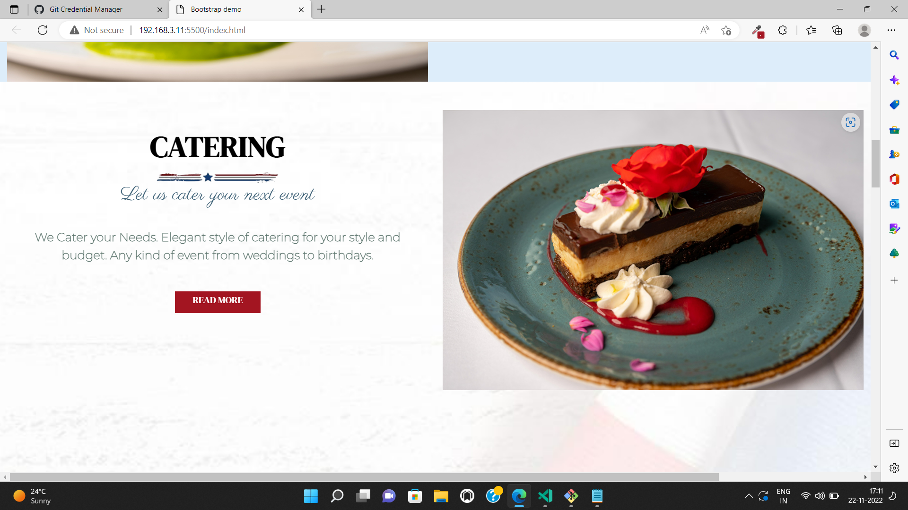
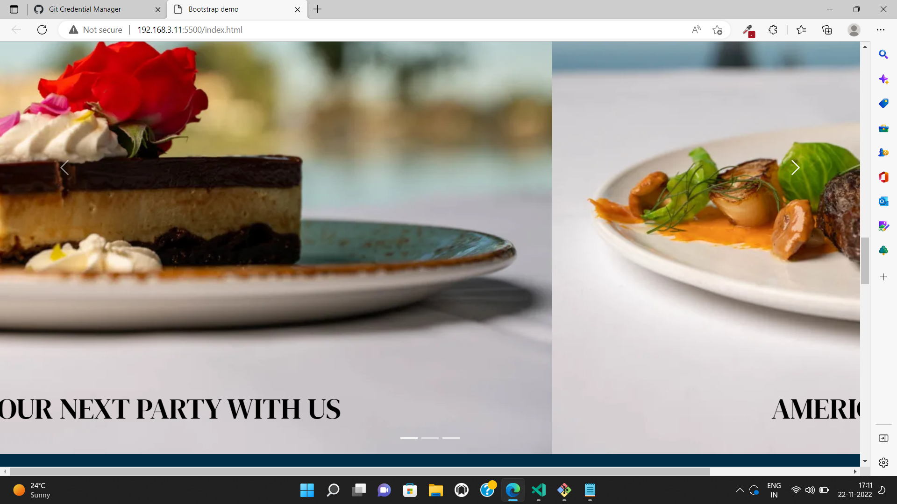
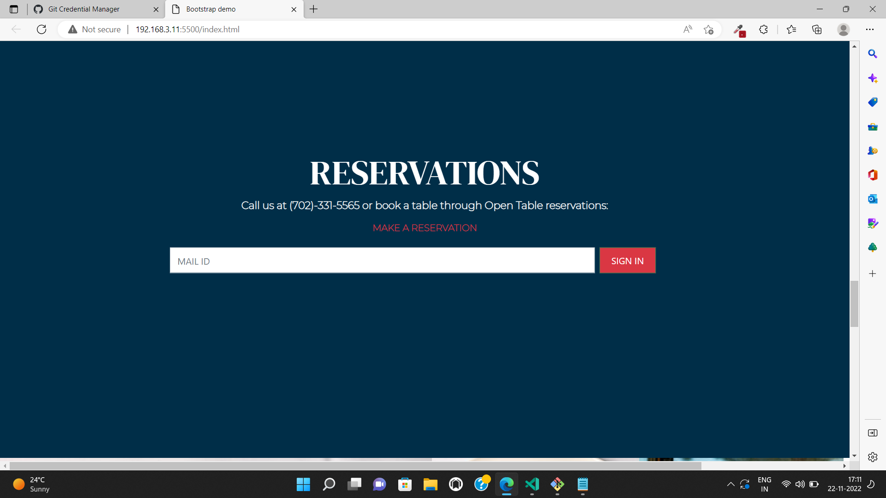
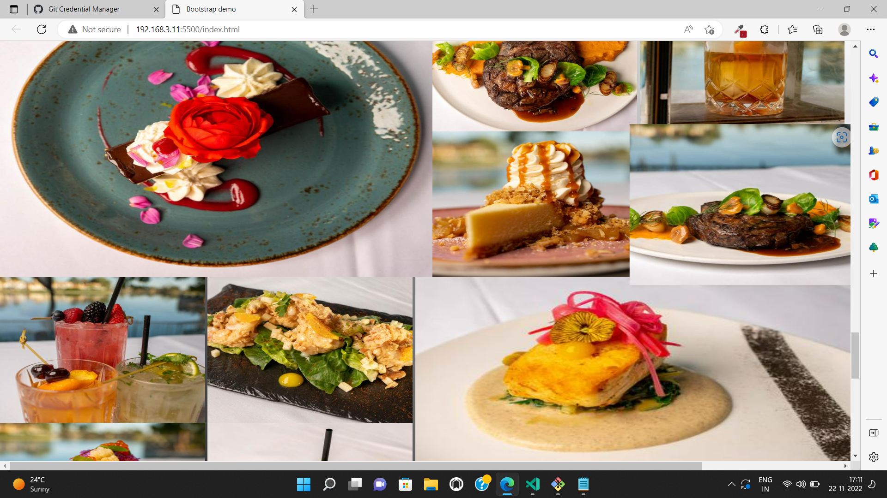
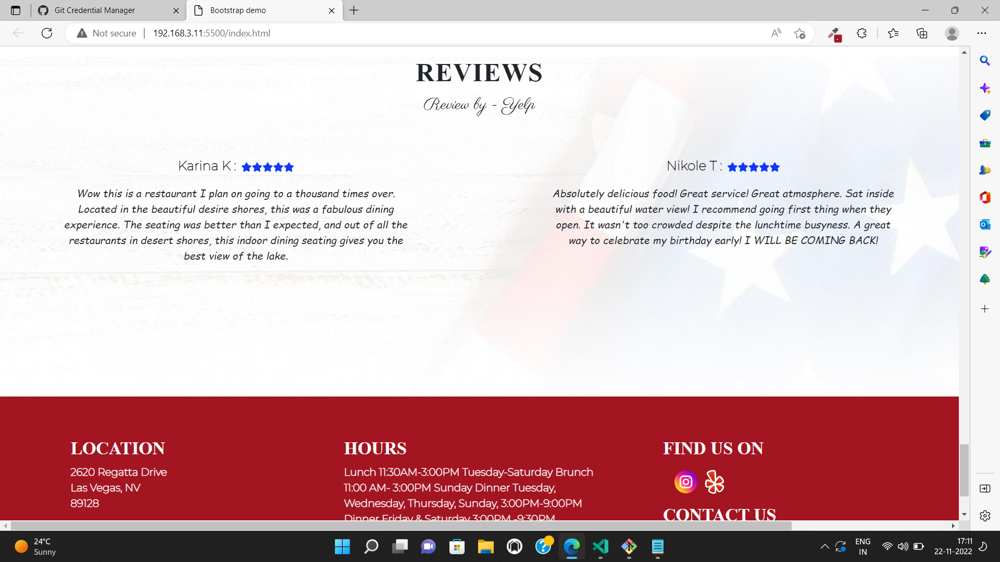

# Americana Restaurant

 

## Project live link
[https://my-adventure-nature.netlify.app](https://my-adventure-nature.netlify.app "project01")

## Screenshot

 

## project Type
- UI Design

## My learning from this Project
- About z-index
- How to design HTML Code
- Button Designing
- Hover effect
- Background image
- slide shows
- Annimation
- Background video
- Media Quary
- 2D transform

## Honest time to make this project
#### Approx 8 hour to make this project